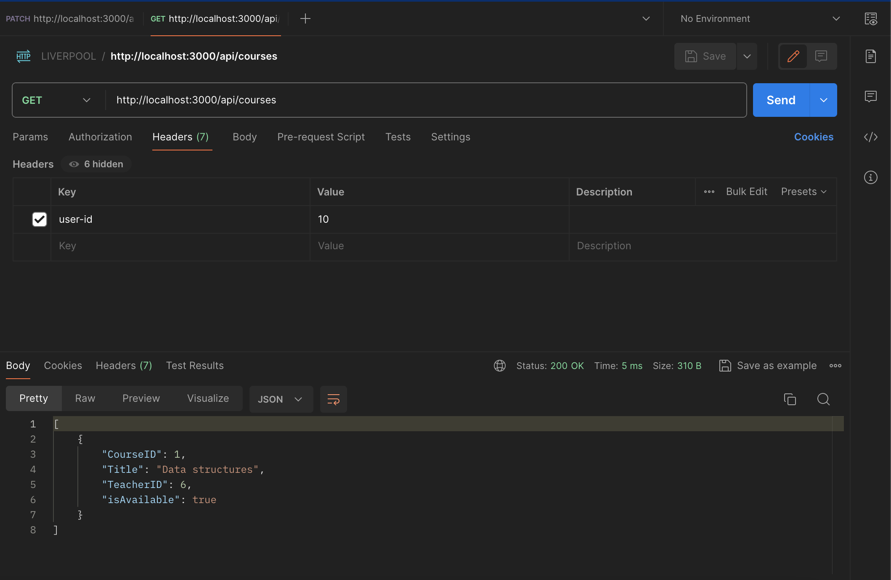
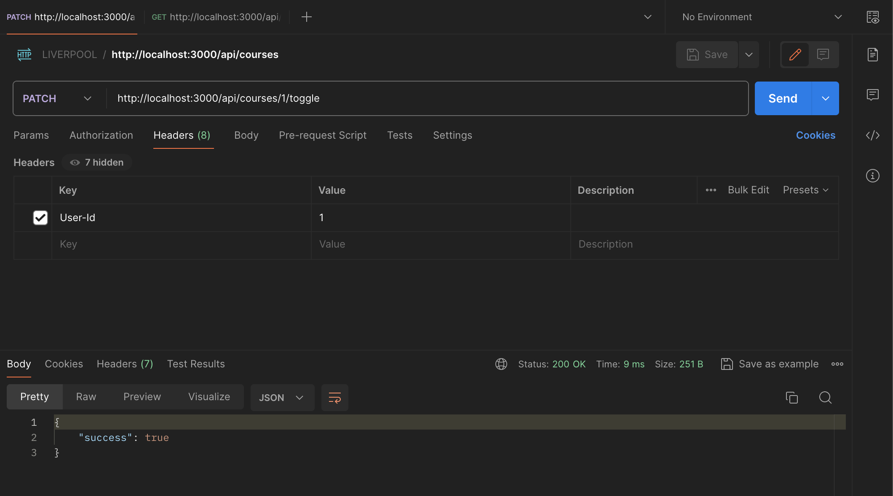

1. `npm install`
2. `node server.js`
3. Try with Postman. Notice to add a header with "user-id" to bypass role check.

## API List
1. GET http://localhost:3000/api/courses. Try to key in userId of a student, then userId of an admin. You
will see the differences between the result.

2. PATCH http://localhost:3000/api/courses/1/toggle
