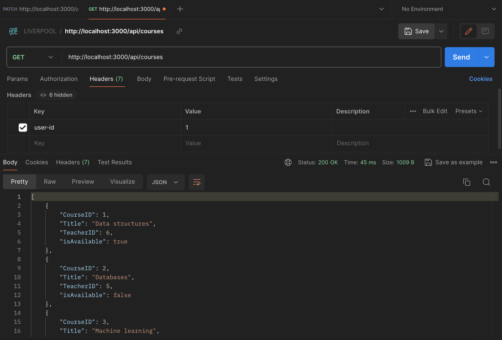

## Steps
1. Clone this repository to your computer and open Terminal inside it.
2. Open `dbConnection.js` and change `database` to your database name.
3. `npm install -g nodemon`
4. `npm install`
5. `nodemon src/server.js`. This ensures all changes to the code are effective without restarting the server.
6. Try the APIs below with Postman. Notice to add a header with "user-id" to bypass role check.

## API List
1. GET http://localhost:3000/api/courses. Try to key in userId of a student, then userId of an admin. You
will see the differences between the result.

userId is admin

userId is student

2. PATCH http://localhost:3000/api/courses/1/toggle
